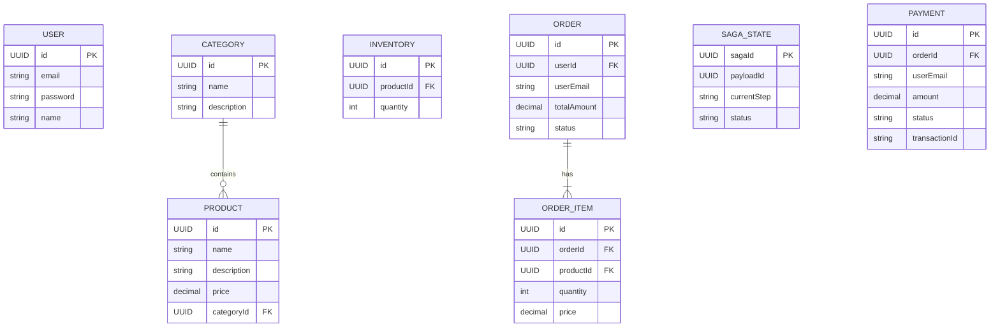

# 🚀 E-Commerce Microservices

A production-grade, highly scalable E-Commerce backend architecture built using **Spring Boot 3**, **Apache Kafka**, **PostgreSQL**, and **Redis**. This system demonstrates advanced enterprise microservices patterns, including **Saga Orchestration** for distributed transactions, **Distributed Locking** to prevent race conditions, and an **Event-Driven Architecture**.

## 📖 Project Description

This project solves the complex challenge of managing distributed transactions across independent microservices. In an e-commerce platform, placing an order requires reserving inventory, processing payments, and sending email notifications. If any step fails (e.g., card declined), all previous steps must be rolled back.

To solve this, the application implements the **Saga Pattern** with centralized orchestration to guarantee strong eventual consistency. It utilizes a zero-trust API Gateway security model and distributed locking to ensure high availability and data integrity under high traffic.

**Target Users:** Backend engineers, software architects, and DevOps professionals looking to understand real-world Java microservices at scale.

---

## ✨ Features

- **Centralized Microservices Routing**: All incoming traffic routed through a Spring Cloud Gateway.
- **Zero-Trust Security**: JWT authentication validation at the Gateway level before request propagation.
- **Saga Orchestration**: Centralized complex transaction management (Order -> Inventory -> Payment).
- **Compensating Transactions**: Automatic rollback mechanisms driven by Kafka events if a saga step fails.
- **Distributed Locking**: Redisson integrated to prevent concurrent checkout race conditions (overselling).
- **Database-per-Service**: Independent PostgreSQL instances ensuring loose coupling.
- **Event-Driven Notifications**: Reactively dispatches emails via Gmail SMTP.
- **Stripe Payments**: Integrated with the Stripe Java SDK for real transaction processing.
- **Observability Stack**: Full metrics tracking via Prometheus and Grafana dashboards.

---

## 🛠 Tech Stack

### Backend
- **Java 21**
- **Spring Boot 3.3.x**
- **Spring Cloud Gateway** (API Routing)
- **Spring Data JPA & Hibernate** (ORM)
- **Spring Kafka** (Message Broker Integration)
- **Spring Boot Mail** (SMTP Emails)

### Database & Caching
- **PostgreSQL 16** (Relational Database)
- **Redis 7** (Caching & Distributed Locks via Redisson)

### DevOps & Tools
- **Docker & Docker Compose** (Containerization & Orchestration)
- **Apache Kafka** (Event Streaming)
- **Zookeeper** (Kafka Coordination)
- **Prometheus** (Metrics Collection)
- **Grafana** (Metrics Visualization)

---

## 🏗 Project Architecture

This project strictly adheres to the **Microservices Architecture** style.

- **Tight Cohesion, Loose Coupling**: Each microservice is responsible for a single business domain and holds its own database.
- **Communication Methods**:
  - **Synchronous**: External clients hit the **API Gateway** via REST over HTTP.
  - **Asynchronous**: Microservices communicate internally using **Apache Kafka** command and event streams.

### System Architecture Diagram


### Backend Layered Architecture
Each individual microservice follows the **Clean 3-Tier Layered Architecture**:


---

## 📁 Folder Structure

```
e-commerce-microservices/
├── api-gateway/            # Routes external traffic, authenticates JWTs
├── order-service/          # Handles orders, acts as Saga Orchestrator
├── inventory-service/      # Manages stock, enforces Redis distributed locks
├── payment-service/        # Stripe integration, payment compensations
├── product-service/        # Product and Category management CRUD
├── notification-service/   # Asynchronous email listener
├── user-service/           # User lifecycle and authentication
├── shared-lib/             # Cross-cutting concerns (DTOs, Events, Exceptions)
├── observability/          # Prometheus and Grafana config
├── docker-compose.yml      # Complete infrastructure blueprint
└── README.md
```

## 🔄 Project Workflow (The Saga)

### Request Lifecycle


*(Note: If the `ProcessPaymentCommand` fails, the `PaymentFailedEvent` tells the Orchestrator to emit a `ReleaseInventoryCommand` back to the Inventory service to unlock the items.)*

---

## 🗄 Database Design

Automatically inferred entity relationships per independent service module:



---

## 🔒 Authentication Flow

Security is pushed to the edge. The system utilizes stateless JWT authentication.


---

## 📡 API Documentation

| Endpoint | Method | Service | Description | Authentication |
| -------- | ------ | ------- | ----------- | -------------- |
| `/api/users/register` | `POST` | User | Register a new account. | Public |
| `/api/users/login` | `POST` | User | Login and retrieve JWT token. | Public |
| `/api/users/profile` | `GET` | User | Retrieve current user profile. | Bearer Token |
| `/api/categories` | `GET/POST` | Product | List all / create categories. | Bearer Token |
| `/api/products` | `GET/POST` | Product | List all / create products. | Bearer Token |
| `/api/inventory/{id}` | `GET` | Inventory | Get stock level for product. | Bearer Token |
| `/api/orders` | `POST` | Order | Initiate Saga to create new order. | Bearer Token |
| `/api/orders/{id}` | `GET` | Order | Fetch order details. | Bearer Token |
| `/api/payments/order/{id}` | `GET` | Payment | Fetch payment details for order. | Bearer Token |

---

## 🌍 Environment Variables

Create a `.env` file at the root to run locally:

```env
# Database Credentials
DB_USER_PASSWORD=postgres
DB_ORDER_PASSWORD=postgres
DB_PAYMENT_PASSWORD=postgres
DB_PRODUCT_PASSWORD=postgres
DB_INVENTORY_PASSWORD=postgres

# External Integrations
STRIPE_API_KEY=sk_test_fake_local_key_or_real
GMAIL_USERNAME=your-email@gmail.com
GMAIL_APP_PASSWORD=your-16-digit-app-password

# Security Configurations
JWT_SECRET=your_super_secret_jwt_parsing_key_must_be_long_enough
JWT_EXPIRATION=86400000

# API Gateway Configuration
RATE_LIMIT_REQUESTS_PER_MINUTE=60
MAX_REQUEST_SIZE=1048576
CORS_ALLOWED_ORIGINS=http://localhost:3000

# Grafana
GRAFANA_ADMIN_PASSWORD=admin
```

---

## 🏃‍♂️ How to Run Locally

1. **Prerequisites**: Ensure Docker Desktop is running and Maven is installed.
2. **Setup Secrets**: Duplicate the `.env.example` (or use the template above) to create a `.env` file at the root directory.
3. **Build and Boot via Docker**:
   ```bash
   # This will compile all Spring Boot microservices into Docker multi-stage images
   # and boot the entire infrastructure!
   docker-compose up -d --build
   ```
4. **Verify Health**:
   ```bash
   docker ps
   ```
   *Ensure all `postgres`, `kafka`, `api-gateway`, and `*-service` containers are running.*
5. **Observe Metrics**: Visit Grafana at `http://localhost:3001` (admin/admin).

## 🚀 Future Improvements

1. **Circuit Breaker**: Implement `Resilience4J` in the API Gateway to prevent cascading failures if a downstream microservice crashes.
2. **Dead Letter Queues (DLQ)**: Enhance Kafka consumers to send unprocessable messages to a dedicated DLQ topic for manual review.
3. **Kubernetes Deployment**: Migrate from Docker Compose to K8s manifesting for true autoscaling capability.
